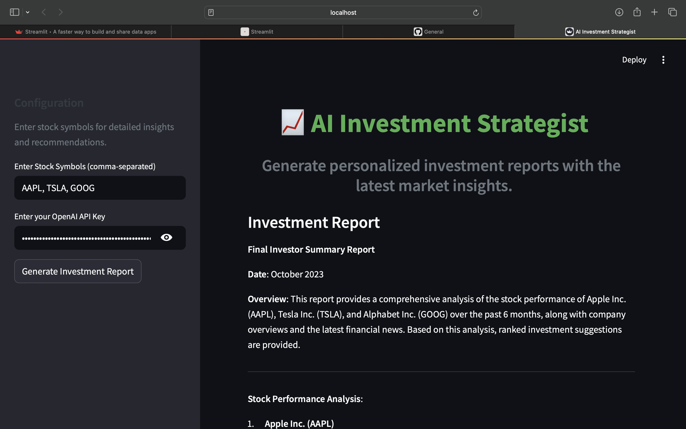
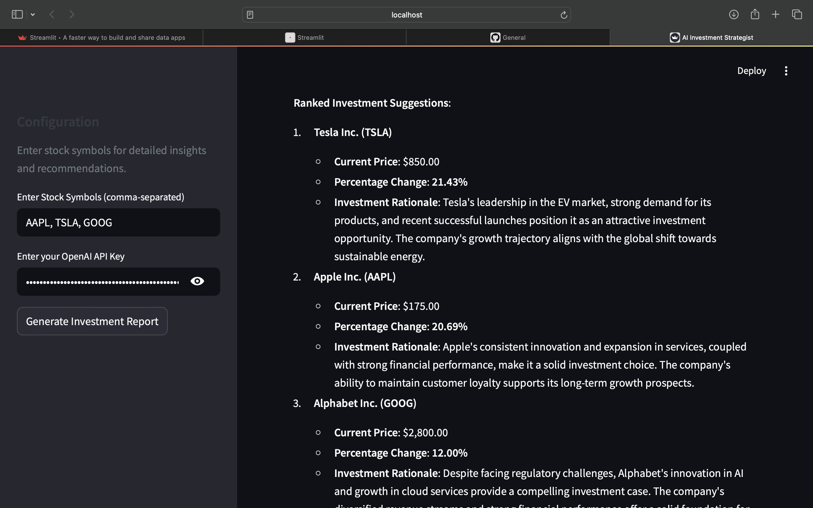
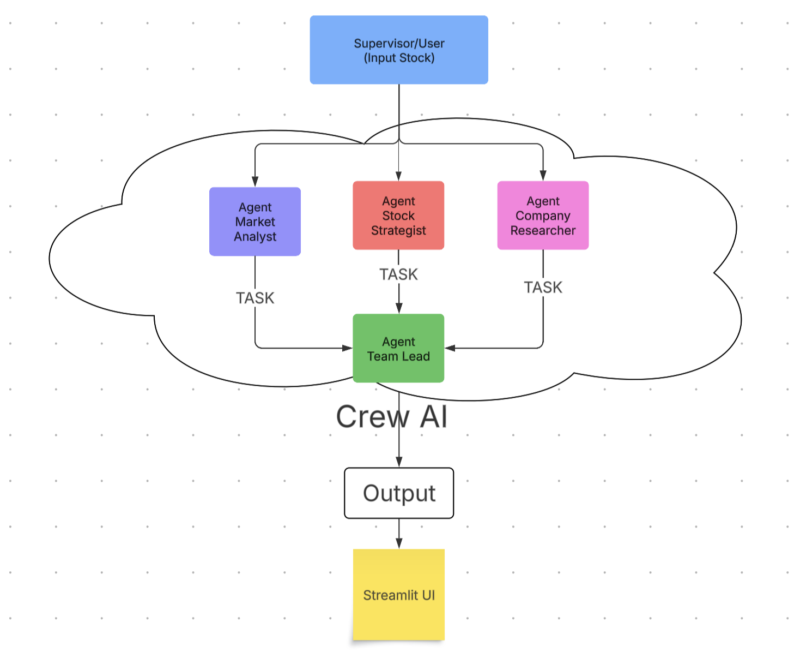

# 📈 AI Investment Strategist (CrewAI Agents)

An intelligent investment advisor that uses autonomous agents to analyze stock performance, research company fundamentals and news, and generate personalized investment reports — all built with CrewAI and OpenAI GPT-4o-mini.

## 🚀 Features
- 📊 Real-time 6-month stock performance comparison using yfinance
- 🧠 Multi-agent analysis
- 📃 Final ranked investment suggestions
- 🌐 Web UI using Streamlit
- 📈 Interactive performance chart with Plotly

## 🛠️ Tech Stack
- 🧠 CrewAI
- 💬 OpenAI GPT-4o-mini (langchain integration)
- 📈 yFinance, Plotly
- 🧰 Streamlit for frontend

### 📈 Stock Comparison

### 🔧 UI

### 📈 Investment Suggestions

### 🧠 Multi-Agent Workflow

